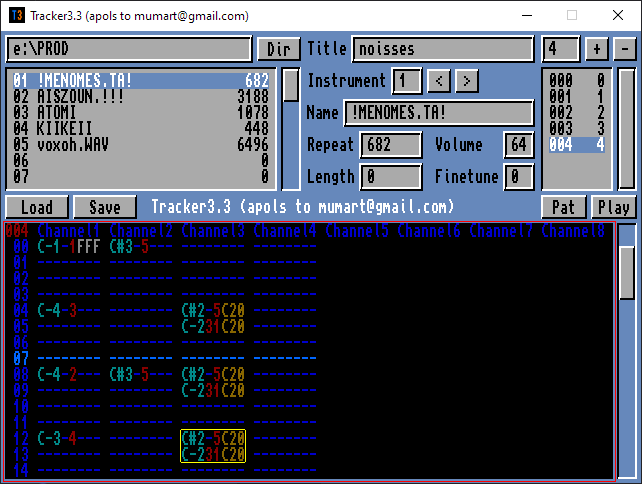

# Tracker3

Fork of [Martin Cameron's simple music editor for 4 and 8 channel Protracker modules](https://github.com/martincameron/tracker3), with a handful of features I think make it more useful as an editor. 

> 
>
> Modules and samples can be loaded by pressing DIR and navigating to the file.
>
> Hold shift to load IFF-8SVX and signed 8-bit RAW samples with no file extension.
>
> Notes can be entered using a virtual piano keyboard (QWERTY layout).
>
> Selections can be made by holding shift with the cursor keys, home and end.
>
> Pressing shift when keying a note will paste the copied selection with transpose.
>
> ~~Pressing space will silence all channels.~~
>
> Other functions can be accessed using the function keys:
>
> * F1: Set octave 1 for note entry.
> * F2: Set octave 2 for note entry.
> * F3: Set octave 3 for note entry.
> * F4: Set octave 4 for note entry.
> * F5: Copy selection.
> * F6: Paste selection.
> * F7: Toggle simple reverb effect.
> * F8: Toggle 4 and 8 channels.
> * F9: Save current instrument as raw sample.
> * Shift + F9: Crop current instrument to loop points.
> * Shift + F10: Delete all unused patterns and instruments.
>
> Saved modules only include patterns up to the highest used in the sequence.

I love the portability of jarred apps, and the prevalence of java on enterprise machines makes them a fun way to play with toys even on a work laptop with a draconian app whitelisty policy.

__Now includes:__
* yellow outline to highlight focused gadget
* red outline around pattern panel during editing
* additonal keys:
    * spacebar: toggle playback
    * shift + spacebar: toggle ploopback (playback but it loops the current pettern instead of the whole sequence)
    * period: cycle through input gadgets in top section
    * comma: cycle backwards through input gadgets in top section
    * forward slash: focus pattern editor and select top of pattern
    * escape (while in edit mode): focus on the directory text field
 * obnoxiously intrusive and unclear code commenting
 
__Might one day include:__
* ~~ploop button to only play the current pattern instead of the whole sequence~~ done
* better keyboard interaction so you can hit enter to trigger button gadgets
* ~~auditioning samples~~ actually nah, this isn't a daw, it's a desktop toy. You have better ways of auditioning samples on your OS.
* ~~replacing mumart's copyright notice with an attribution/apology~~
* forward slash key also recentring the playhead on row 0
* me getting smart enough to diagnose and fix bug with ploop where occasionally it plays the first loop at double speed
* better 'edit mode' flag - currently it just outlines red when the pattern panel is focused. It'd be good to do the full protracker and have it red only when the pattern panel accepting input
* keyboard shortcuts for cycling through the patterns. Half implemented, but not useful without playhead following, and maybe an indicator for what the current pattern is somewhere.

## Jarred app is here

You get a [hyperlink](https://github.com/illettante/tracker3/raw/refs/heads/master/build/tracker3.3.jar) instead of a release because this is not so much a version release as an act of vandalism.
